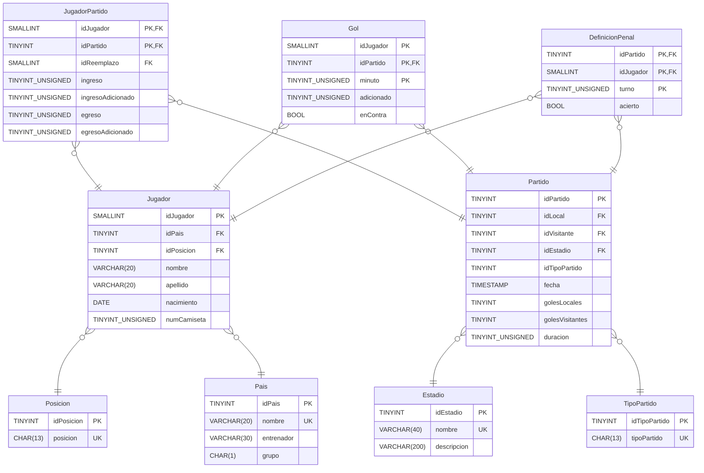

<h1 align="center">E.T. Nº12 D.E. 1º "Libertador Gral. José de San Martín"</h1>

  

# BD-Mundial22
 Material para Base de Datos 

## DER

## Relevamiento

## Ejercicios

[Base de Datos](Enunciados/bd/README.md)

## Créditos

Ayudaron en este script alumnos de 5º7º y 5º8º Ciclo 2023
