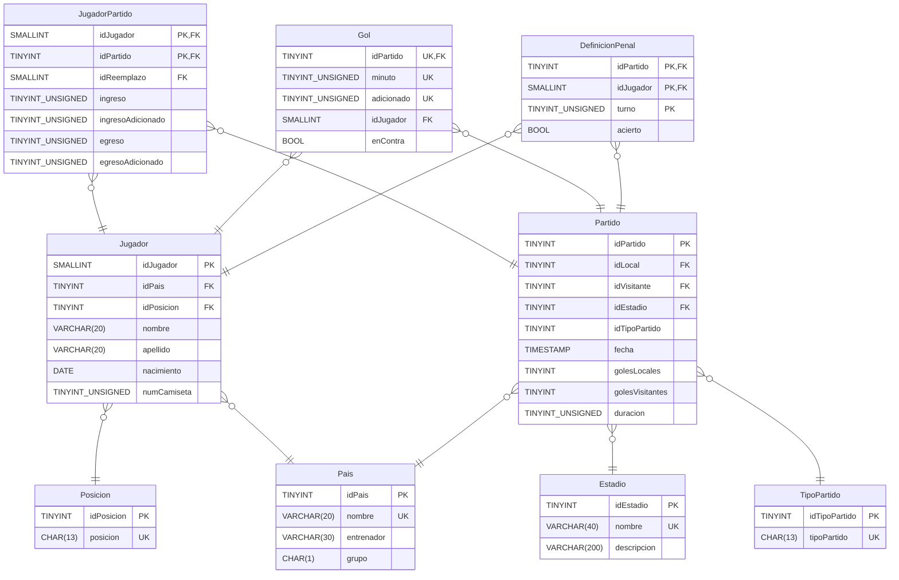

<h1 align="center">E.T. Nº12 D.E. 1º "Libertador Gral. José de San Martín"</h1>
<p align="center">
  
</p>

# BD-Mundial22
 Material para Base de Datos 

## DER



## Relevamiento 👓


## Pre-requisitos 📋

- MySQL 🐬 8.0.34
- Visual Studio Code (si se quiere acceder a leer las guías de TP)

## Instalación 🔧

Actualmente hay 2 formas de instalar esta BD:
- Una desatendida mediante Docker 🐳 (consume mas RAM pero no hace falta que tengas instalado ni configurado MySQL en tu pc)
- Otra mediante MySQL 🐬 donde ya tenes que tener previamente instalado y configurado este SGBD ("complejo" de instalar, se hace una vez y no tiene tanto consumo de RAM).

### Instalación Nativa con MySQL 🐬

1. Abrir la terminal en el directorio raíz de este repositorio (recomendamos tener MySQL agregado en tus **Variables de entorno**).

1. Ejecutar el comando: `mysql -u usuario -p` donde *usuario* es el nombre de usuario con el que entras al sistema. Si estas en la secu podes usar: `mysql -u root -p`. Se te va a preguntar por la contraseña de tu usuario, recorda que si estas en la secu la misma es *root* (para las compus con Windows).

1. Ya dentro del cliente de `MySQL` tipeamos `source install.sql` y nos debería quedar algo como: `mysql> source install.sql` ; le damos _Enter_.

1. Esperamos que termine de correr el comando y salimos de la _shell_ de MySQL con el comando `exit`.

### Instalación mediante Docker 🐳

1. Abrir la terminal en el directorio raíz de este repositorio (recomendamos tener Docker agregado en tus **Variables de entorno**).

1. Ejecutar el comando para construir la imagen:
    ```bash
    docker build --pull --rm -f "Dockerfile" -t bdmundial22:latest "."
    ```

1. Y ejecutar el comando para ejecutar la imagen:
    ```bash
    docker run -p 33306:3306 bdmundial22
    ```
    El comando anterior exponer MySQL mediante el puerto 33306.

## Ejercicios 🖋

[Base de Datos](Enunciados/bd/README.md)

## Créditos

Ayudaron en este script alumnos de 5º7º y 5º8º Ciclo 2023
