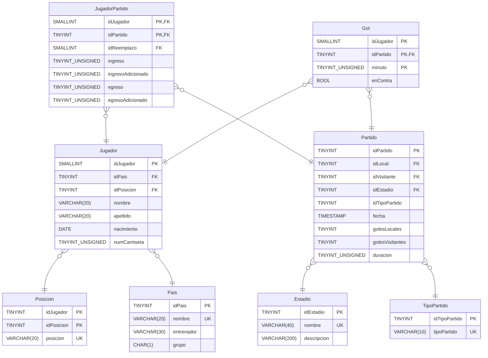

# BD-Mundial22
 Material para Base de Datos 

## DER

```mermaid
erDiagram
    Pais{   
        TINYINT idPais PK
        VARCHAR(20) nombre UK
        VARCHAR(30) entrenador
        CHAR(1) grupo
    }
    Estadio{
        TINYINT idEstadio PK
        VARCHAR(40) nombre UK
        VARCHAR(200) descripcion
    }
    TipoPartido{
        TINYINT idTipoPartido PK
        VARCHAR(10) tipoPartido UK
    }
    Partido{
        TINYINT idPartido PK
        TINYINT idLocal FK
        TINYINT idVisitante FK
        TINYINT idEstadio FK
        TINYINT idTipoPartido
        TIMESTAMP fecha
        TINYINT golesLocales
        TINYINT golesVisitantes
        TINYINT_UNSIGNED duracion
    }
    Posicion{
        TINYINT idJugador PK
        TINYINT idPosicion PK
        VARCHAR(20) posicion UK
    }
    Jugador{
        SMALLINT idJugador PK
        TINYINT idPais FK
        TINYINT idPosicion FK
        VARCHAR(20) nombre
        VARCHAR(20) apellido
        DATE nacimiento 
        TINYINT_UNSIGNED numCamiseta
    }
    JugadorPartido{
        SMALLINT idJugador PK, FK
        TINYINT idPartido PK, FK
        SMALLINT idReemplazo FK
        TINYINT_UNSIGNED ingreso
        TINYINT_UNSIGNED ingresoAdicionado
        TINYINT_UNSIGNED egreso
        TINYINT_UNSIGNED egresoAdicionado
    }
    Gol{
        SMALLINT idJugador PK
        TINYINT idPartido PK, FK
        TINYINT_UNSIGNED minuto PK
        BOOL enContra
    }

    Jugador }o--|| Posicion :""
    Jugador }o--|| Pais :""
    Partido }o--|| Estadio :""
    Partido }o--|| TipoPartido :""
    JugadorPartido }o--|| Jugador :""
    JugadorPartido }o--|| Partido :""
    Gol }o--|| Jugador :""
    Gol }o--|| Partido :""


```

## Relevamiento

## Créditos

Ayudaron en este script alumnos de 5º7º Ciclo 2023
