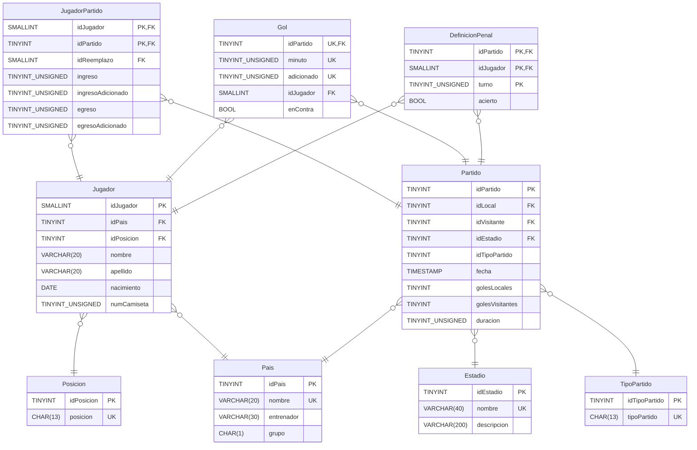

<h1 align="center">E.T. Nº12 D.E. 1º "Libertador Gral. José de San Martín"</h1>
<p align="center">
  
</p>

# BD-Mundial22 ⭐⭐⭐
 Material para Base de Datos 

## DER



## Relevamiento 🔎

## Comenzando 🚀

Clonar el repositorio github, desde Github Desktop o ejecutar en la terminal o CMD:

```
git clone https://github.com/ET12DE1Computacion/BD-PokemonRPG
```

## Pre-requisitos 📋

- MySQL 8.0.x 🐬

## Despliegue 📦

1. Abrir la terminal en el directorio donde están los scripts (recomendamos tener MySQL agregado en tus **Variables de entorno**).

1. Ejecutar el comando: `mysql -u usuario -p` donde *usuario* es el nombre de usuario con el que entras al sistema. Se te va a preguntar por la contraseña de tu usuario.

1. Ya dentro del cliente de `MySQL` tipeamos `source install.sql` y nos debería quedar algo como: `mysql> source install.sql` ; le damos <kbd> Enter </kbd>.

1. Esperamos que termine de correr el comando y salimos de la _shell_ de MySQL con el comando `exit`.

## Ejercicios 🏋🏾‍♀️

- [Base de Datos](Enunciados/bd/README.md)
- [Administración y Gestión de Base de Datos](Enunciados/agbd/README.md)

## Créditos 💌

Ayudaron en este script:
- Alumnos de 4°7°, 4° 8°, 5°7° y 5°8° Ciclo 2023.
- Alumnos de 5°7° y 5°8° Ciclo 2024.
