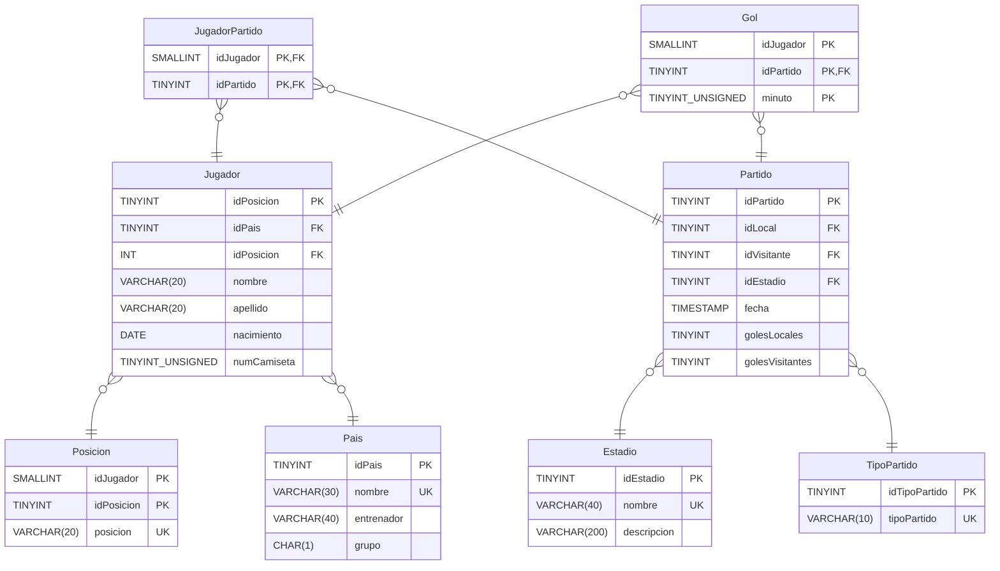

# BD-Mundial22
 Material para Base de Datos 

## DER

```mermaid
erDiagram
    Pais{
        TINYINT idPais PK
        VARCHAR(30) nombre UK
        VARCHAR(40) entrenador
        CHAR(1) grupo
    }
    Estadio{
        TINYINT idEstadio PK
        VARCHAR(40) nombre UK
        VARCHAR(200) descripcion
    }
    TipoPartido{
        TINYINT idTipoPartido PK
        VARCHAR(10) tipoPartido UK
    }
    Partido{
        TINYINT idPartido PK
        TINYINT idLocal FK
        TINYINT idVisitante FK
        TINYINT idEstadio FK
        TIMESTAMP fecha
        TINYINT golesLocales
        TINYINT golesVisitantes
    }
    Posicion{
        SMALLINT idJugador PK
        TINYINT idPosicion PK
        VARCHAR(20) posicion UK
    }
    Jugador{
        TINYINT idPosicion PK
        TINYINT idPais FK
        INT idPosicion FK
        VARCHAR(20) nombre
        VARCHAR(20) apellido
        DATE nacimiento 
        TINYINT_UNSIGNED numCamiseta
    }
    JugadorPartido{
        SMALLINT idJugador PK, FK
        TINYINT idPartido PK, FK
    }
    Gol{
        SMALLINT idJugador PK
        TINYINT idPartido PK, FK
        TINYINT_UNSIGNED minuto PK
    }

    Jugador }o--|| Posicion :""
    Jugador }o--|| Pais :""
    Partido }o--|| Estadio :""
    Partido }o--|| TipoPartido :""
    JugadorPartido }o--|| Jugador :""
    JugadorPartido }o--|| Partido :""
    Gol }o--|| Jugador :""
    Gol }o--|| Partido :""


```